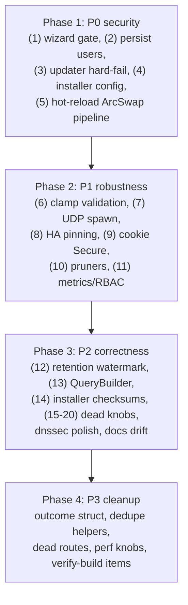

# sito-dns Full Audit — Findings & Fix Plan (handoff document for the implementing agent)

## Context & scope
Audited the whole workspace (14 crates, ~15k LOC): DNS pipeline (`crates/sito/src/pipeline.rs`), transports (`sito-transport`), upstreams (`sito-upstream`), cache, filter engine, REST API + UI (`sito-api`), HA (`sito-ha`), stats (`sito-stats`), config handling, `contrib/install.sh`, Docker, docs. No code was changed during the audit.

Verdict: architecture and test/fuzz hygiene are good, **but the app is not prod-ready yet**. There are 5 critical issues (2 unauthenticated security holes, 1 supply-chain gap, 1 startup-breaking shipped config, 1 hot-reload functional bug) plus multiple high/medium items.

---

## P0 — Critical (fix first)

### 1. Unauthenticated admin password reset (auth bypass)
- `crates/sito-api/src/ui/handlers.rs:1354` `wizard_complete_handler` sets any user's password via `POST /ui/wizard/complete` with **no session check** and remains enabled forever.
- Fix: gate the wizard — only allow when `AuthManager` is in "first-run" state (default admin password still `adminadmin` or an explicit `setup_complete` flag persisted in `data_dir`). Require a session for all other cases; return 403/redirect otherwise.

### 2. Admin account, sessions, tokens, TOTP are memory-only
- `crates/sito-api/src/auth/manager.rs` keeps users/sessions/tokens/TOTP in `Mutex<HashMap>`; restart resets the admin password to `admin/adminadmin` (undoing the wizard change) and silently re-enables default creds.
- Fix: persist user accounts (username, argon2 hash, role, TOTP secret) to `data_dir/users.toml` (0600) via atomic write; load in `AuthManager::new()`. Sessions/tokens may stay in-memory (documented behavior).
- Related: `AuthManager::with_config` is never called → the `[auth]` section (`session_ttl_hours`, `login_rate_limit`) is dead. Wire it in `crates/sito/src/server.rs:241`.

### 3. Self-updater proceeds without checksum
- `crates/sito-api/src/updater.rs:312-335`: if `SHA256SUMS` asset is missing, or the hash for the archive is not found, it logs a warning and **replaces the running binary anyway**. No signature verification either.
- Fix: hard-fail (`UpdateError::ChecksumNotFound`) when the checksum cannot be verified; optionally require minisign/Ed25519 sig later. Also: `check_update` (`crates/sito-api/src/handlers/update.rs:41`) has no auth → add `RequireViewer`; `apply_update` accepts a `repo` param that should be restricted to an allowlist (SSRF hardening).

### 4. Installer ships a config that fails at startup
- `contrib/install.sh:144-148` defaults to `servers = ["tls://dns.quad9.net", "https://cloudflare-dns.com/dns-query"]`, but `UpstreamManager::create_managed_entry` (`crates/sito-upstream/src/manager.rs:42-91`) only supports `tls://` and plain UDP — the `https://` URL is parsed as host `"https"` → bootstrap resolve fails → **server refuses to start on first install**.
- Also `install.sh` `[web] bind = ["0.0.0.0"]` is an array while `WebConfig.bind` is a scalar `IpAddr` → silently falls back to defaults; `https`, `query_log_enabled`, `anonymize_client_ip`, `prometheus_enabled` are unknown keys.
- Fix: change installer default to `tls://dns.quad9.net` + `1.1.1.1` (UDP); fix `[web] bind = "0.0.0.0"`; remove nonexistent keys or implement them. Add a startup warning (not silent fallback) when `[web]`/`[stats]`/`[auth]` sections fail to parse.

### 5. Hot-reload is half-applied (settings/rewrites/clients don't reach the pipeline)
- The pipeline captures startup `Arc<Config>`, `Arc<RewriteTable>`, `Arc<ClientRegistry>` (`crates/sito/src/server.rs:128-147`). UI/REST/file-watcher only update `config_arc` ArcSwap → these never take effect until restart:
  - blocking mode/TTL, `anti_doh_bypass`, `cname_cloaking`, cache enabled/read from `self.config` in `pipeline.rs`
  - rewrites edited in UI (`ui/handlers.rs:742,788` store into `rewrites_arc` — pipeline ignores it; same for `clients_arc`)
  - settings page (`ui/handlers.rs:1144`) writes cache size/rate limit/dnssec — nothing propagates to `DnsCache`/listeners
  - upstream config PUT (`handlers/upstream.rs:74`) never rebuilds `UpstreamManager`
- Fix (minimal consistent design): make `ServerContext` own `ArcSwap` handles and have the **pipeline read them per query** (cheap `load()`), i.e. pass `Arc<ArcSwap<Config>>`, `Arc<ArcSwap<RewriteTable>>`, `Arc<ArcSwap<ClientRegistry>>` into `DnsPipeline`. For upstream/cache/rate-limit changes that need re-instantiation, either rebuild managers on save or clearly respond "restart required" (never claim success silently).

---

## P1 — High

### 6. Cache insert can panic → server crash (`panic = "abort"`)
- `crates/sito-cache/src/cache.rs:201` `raw_negative_ttl.clamp(min_ttl, negative_ttl_max)` panics when `negative_ttl_max < min_ttl`; `CacheConfig::validate` (`sito-core/config.rs:502`) never checks this. With `panic = "abort"` in release profile this kills the whole server.
- Fix: validate `negative_ttl_max >= min_ttl` in `CacheConfig::validate`, and use `clamp(min, max.max(min))` defensively.

### 7. UDP listener head-of-line blocking
- `crates/sito-transport/src/udp.rs:140` awaits `handler.handle(...)` inline in the recv loop; one slow upstream (5 s default timeout, failover loop) stalls all queries on that worker socket.
- Fix: spawn per-query task with a bounded semaphore (e.g. 1024) like TCP does; keep a small inline path for tiny/answer-only flows if benchmarked worthwhile.

### 8. HA replication authentication gaps
- `crates/sito-ha/src/transport/mtls.rs:88`: empty `pinned_slave_fingerprints` ⇒ **any client cert accepted**; slave verifier (`mtls.rs:150`) with no pinned master fingerprint accepts any server cert (MITM can observe config; replay of older signed bundles is a downgrade vector).
- Master WS (`master/coordinator.rs:127-218`) has no protocol-level auth when TLS is off.
- Fix: require non-empty pins when TLS is enabled (fail fast at startup); refuse plain-WS replication unless an explicit `allow_insecure = true` is set; add WS-level auth (signed Hello challenge using the existing Ed25519 keys) as defense-in-depth; document pin setup in `docs/runbook-ha.md`.

### 9. Secure cookie vs plain-HTTP admin UI (login broken off-localhost)
- `auth/session.rs:50` sets `Secure` on the session cookie, but the web UI defaults to HTTP on `0.0.0.0:8080` → browsers drop the cookie on any non-localhost host.
- Fix: set `Secure` only when the request is HTTPS (detect via `X-Forwarded-Proto` from trusted proxies or configured `web.tls`), and warn at startup when admin UI binds non-loopback over HTTP.

### 10. Lockout/session maps grow unbounded (memory DoS)
- `auth/lockout.rs` (`attempts`, `ip_rates`) and `manager.rs` `sessions`/`pending_totp_setups`/`partial_tokens` never evict expired/idle entries except on access.
- Fix: periodic prune task (like `RateLimiter::spawn_pruner`) + cap map sizes.

### 11. `/metrics` and UI RBAC inconsistencies
- `/metrics` (`router.rs:175`) is unauthenticated — info disclosure; protect with `RequireViewer` (keep scrape via token).
- `filtering_simulate_handler` (`ui/handlers.rs:608`) has no session check; other UI action handlers check session only (no role); `system_update_apply_handler` correctly checks Admin — make role checks uniform (Operator for mutations, Admin for update/restore).
- REST has unauthenticated Swagger UI at `/api/docs` — acceptable, but document it; consider feature flag.

---

## P2 — Medium

12. **stats_hourly double counting** — `sito-stats/src/db.rs:489-549` `cleanup_retention` re-aggregates *all* rows older than the cutoff on every run, inflating hourly buckets. Track a watermark (max `id`/`ts` already aggregated) and aggregate only newer rows.
13. **SQL string building** — same file `query_logs` uses `format!` + `sqlx::AssertSqlSafe` with manual quote-escaping; `%` escaping via `\%` is wrong without `ESCAPE '\'`. Refactor to `sqlx::QueryBuilder` with `push_bind` for all user inputs.
14. **Updater/installer checksum parity** — `contrib/install.sh:74-87` also continues when checksums fail/missing; mirror the hard-fail from P0-3. Add checksum-failure message guidance.
15. **`refresh_hours` is a dead knob** — per-list `FilterListConfig.refresh_hours` is stored/propagated but the scheduler (`sito-filter/engine.rs:385-401`) uses only the global interval. Either implement per-list scheduling or remove the field (also from UI forms).
16. **DNSSEC polish** — `DnssecConfig.validate` bool (`sito-core/config.rs:532`) is dead (only `mode` is read) — remove or honor it; log validation outcome into querylog (`dnssec: None` always in `pipeline.rs:594`).
17. **Querylog writer shutdown** — `run_server_full` never calls `querylog_writer.shutdown()`/`flush()` on SIGTERM → last batch (≤5 s) is lost. Wire into the shutdown path.
18. **Filter-reload >50% drop guard blocks intentional edits** — `sito-filter/engine.rs:369-377` keeps the old snapshot when rule count halves, so *user-initiated* list deletion silently doesn't apply. Apply the guard only for scheduled refreshes, not for explicit reload/save paths (pass a flag).
19. **Bootstrap resolve of zero IPs** — `create_managed_entry` indexes `resolved_ips[0]` (`manager.rs:60,79`); today unreachable (resolver errors instead), but make it explicit `first().copied().ok_or(...)` for safety.
20. **Config example/docs drift** — `config.example.toml` uses UDP upstreams while docs/installer advertise DoH/DoQ upstreams; UI labels upstreams as DoH/DoQ (`ui/handlers.rs:239-249`) which the manager can't create. Either implement DoH/DoQ upstreams (larger task — split into its own milestone) or fix labels/docs to `tls://`+UDP only in v1.2.x.

---

## P3 — Low / cleanup

21. Duplicate & overengineered code:
    - `pipeline.rs`: the 8-tuple result (9 return sites) → introduce a private `QueryOutcome` struct; extract the 3 nearly identical anti-bypass blocks (lines 151-175, 346-374, 413-444) and the 4 blocked-response builders into helpers.
    - `ui/handlers.rs` has two identical escapers: `escape_html` (line 60) and `html_escape` (line 1205) — keep one.
    - Per-domain routing allocates `format!(".{d_clean}")` per domain per query (`manager.rs:210`) — use `strip_suffix`/precomputed lowercase suffixes; precompute rule suffixes at startup.
    - Dead routes/handlers: `rewrites::update_rewrite`, `clients::get_client_by_name`, `clients::get_client_group_by_name` are never routed — wire them or remove.
    - `tower-http` cors/trace features are pulled but no layer is used — remove or apply.
    - `BlockingMode`/metrics: `queries_total` labels build `String` per query under a global mutex (`metrics.rs:108-114`) — fine for LAN, but consider pre-interned label keys or `DashMap`; note `cache_size_bytes` gauge is never updated.
    - Prefetch in `pipeline.rs:377-388` spawns unbounded tasks per cache hit — gate with a semaphore or single-flight per key.
22. Persisted configs lose unknown keys on save (`save_config_atomic` round-trips only modeled fields) — acceptable, but add a changelog note; consider preserving unknown top-level tables.
23. Installer/systemd: add `MemoryDenyWriteExecute`, `ProtectKernel*`, `SystemCallFilter=@system-service` hardening; print "change default password" warning (ties to P0-2).
24. Verify-build item: `server.rs:286` uses `Duration::from_hours(24)` — confirm the pinned toolchain (rust-toolchain.toml 1.98.1) provides it; otherwise use `from_secs(86_400)`. Same class check: axum built without explicit `json` feature while `axum::Json` is used (works only via feature unification from `utoipa-swagger-ui`) — add `"json"` to workspace axum features explicitly.

---

## Execution order & dependencies

- Phases 1 and 2 are independent of each other and can proceed in parallel once Phase 1's item 5 (pipeline ArcSwap refactor) lands, since later fixes touch the same files.
- Items 15, 16, 20 need a product decision (implement vs remove) — default to "remove dead knobs, fix labels/docs" for the 1.2.x line.

## Verification / Definition of Done
- `cargo build --workspace` and `cargo clippy --workspace -- -D warnings` clean; `cargo test --workspace` green (existing suites in `sito-test/tests/m5..m9_acceptance.rs`, `sito-filter/tests/conformance.rs` must pass unmodified).
- New tests required: wizard gate 403 after setup (P0-1), user persistence across restart (P0-2), updater aborts without checksum (P0-3), clamp validation rejects `negative_ttl_max < min_ttl` (P1-6), pipeline picks up rewrite change without restart (P1-5), retention watermark prevents double counting (P2-12).
- Manual smoke: fresh `install.sh` run on a clean VM → server starts, UI login works over HTTP LAN IP, `POST /ui/wizard/complete` rejected after setup, `/api/v1/system/update/apply` fails loudly without SHA256SUMS.
- Security checklist re-run: no unauthenticated mutating endpoint remains (`rg` sweep over `router.rs` + `ui/mod.rs`); `docs/security-audit.md` updated with resolved items.
