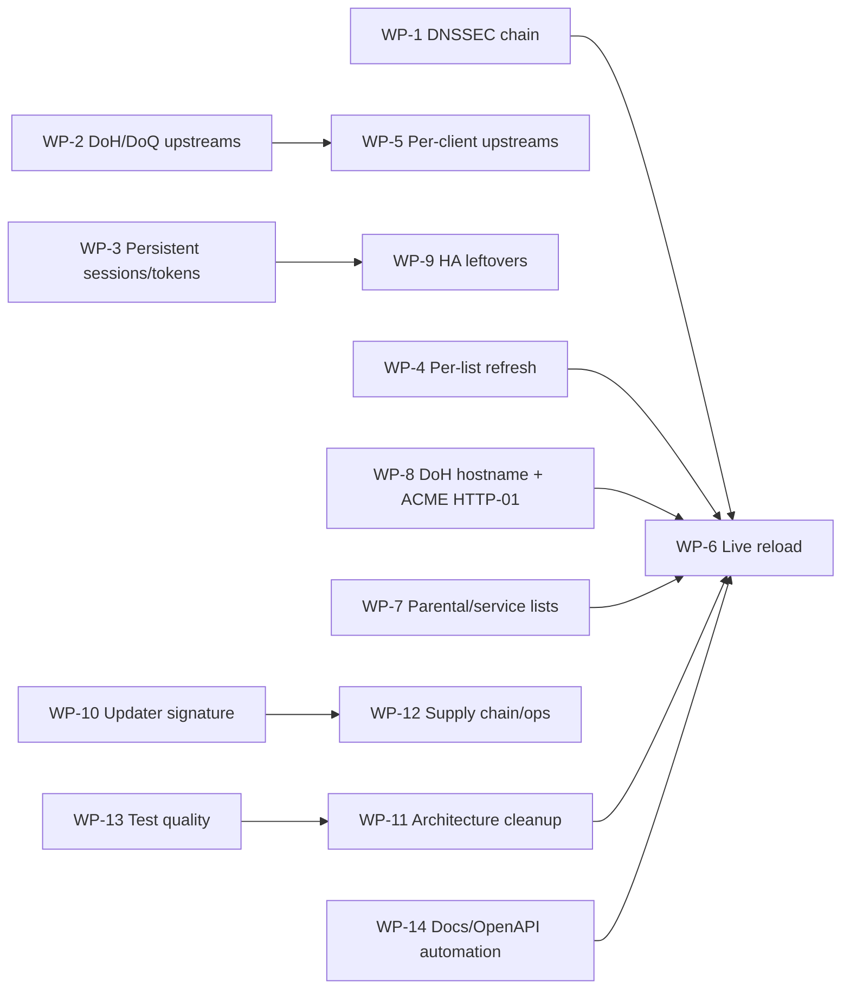

# Audit 3 — Deferred Work Implementation Plan

This document plans every item explicitly deferred by the Audit 3 remediation
(PR #8 / `docs/audit3.md`). It is a working roadmap, not a promise of exact
scheduling: each work package (WP) is self-contained, independently reviewable,
and gated by tests.

## Ground rules

- One branch / one PR per work package (`feat/...`, `fix/...`, `chore/...`).
- Every PR must keep the baseline green:
  `cargo fmt --check && cargo clippy --workspace --all-features -- -D warnings && cargo test --workspace --all-features`.
- No new silently-ignored configuration knobs: a setting is either wired,
  removed, or documented as reserved with a startup warning.
- New behavior requires regression tests (unit + acceptance where the feature is
  user-visible). Update `docs/configuration-reference.md`, `CHANGELOG.md`
  (`[Unreleased]`) and OpenAPI (`docs/openapi.json` regenerated by tests) in the
  same PR.
- Prefer fail-closed/deny-by-default for anything security-relevant.

## Dependency graph



Sizing: **S** ≈ 1–2 days, **M** ≈ 3–5 days, **L** ≈ 1–2 weeks (single
developer, including tests and docs).

---

## Wave A — Security / correctness (do first)

### WP-1 — Full DNSSEC DS/DNSKEY chain validation  (L, no deps)

**Current state.** `crates/sito-dnssec/src/lib.rs` validates RRSIGs but only
marks `Secure` when the signing DNSKEY *is* a configured trust anchor
(`validate_response`, `~:437-449`). There is no DS/DNSKEY walk, so normal
signed zones end up `Indeterminate`; unsigned responses are `Insecure`. The
pipeline forces DO upstream and blocks unvalidated cache to DO clients
(`crates/sito/src/pipeline.rs`), which limits the downgrade window but is not
a substitute for chain validation.

**Scope.**
1. Introduce an async key-resolution interface so the validator can fetch
   `DNSKEY`/`DS` records:
   ```rust
   #[async_trait]
   pub trait DnssecKeyFetcher: Send + Sync {
       async fn query(&self, name: &Name, rtype: RecordType) -> Result<Message, UpstreamError>;
   }
   ```
   Production implementation delegates to `UpstreamManager`; tests use a
   deterministic in-memory fetcher.
2. Chain walk (top-down from closest configured trust anchor):
   - DS lookup for the zone; if no DS and no DNSKEY in parent → `Insecure`
     (unsigned delegation) only when the parent is validated/secure.
   - DNSKEY lookup, key-tag matching, DS digest verification
     (SHA-256, optionally SHA-384; SHA-1 decode-only for legacy).
   - Cache validated keys by `(zone, key_tag)` with the minimum of
     DNSKEY TTL, DS TTL and signature expiration (`KeyCache` extension with
     expiration/`validated` flag).
   - Enforce a maximum chain depth (e.g. 16 labels) and per-query fetch budget;
     loop/cycle detection by visited zone set.
3. Negative proofs: NSEC/NSEC3 denial-of-existence handling for NXDOMAIN/NODATA
   (at minimum: treat NSEC/NSEC3 covering the qname as validated only when the
   covering zone is secure; otherwise `Insecure`).
4. Trust anchor update path: root KSK rollover awareness (accept a DNSKEY
   validated by an existing anchor); expose `sito dnssec refresh-anchors`
   CLI stub only if a remote anchor source is added (out of scope otherwise).
5. `DnssecMode` semantics refined: `Validate` = SERVFAIL on `Bogus`,
   `LogOnly` = log + AD=0, `Disabled` = bypass.
6. Metrics: `dnssec_bogus_total` already wired; add per-zone cache hit/miss
   counters behind the existing registry.

**Tests.**
- Unit: DS digest match/mismatch, missing DS vs. unsigned delegation,
  rollover (two DNSKEYs, one anchored), expired DS, NSEC NXDOMAIN/NODATA,
  cycle/depth guard, fetch budget exhaustion.
- Integration (`sito-test`): serve a synthetic signed zone from a mock
  authority (hickory `dnssec` test util already exists) and assert
  `Secure`/`Bogus`/`Insecure` for the three cases, including SERVFAIL on
  `Bogus` and no AD on `LogOnly`.
- Fuzz target: `fuzz_dnssec_response` feeding arbitrary DNSKEY/DS/RRSIG/NSEC
  sets into the (sync) verification layer.

**Acceptance / DoD.** A real-world signed zone (e.g. `cloudflare.com` via a
mock or live-optional test) validates end-to-end; stripping RRSIGs in
`Validate` mode yields `Bogus`/SERVFAIL or `Insecure` only for genuinely
unsigned delegations; no unbounded memory/recursion.

**Risks.** NSEC3 complexity; resolver loops. Mitigation: depth/fetch budgets,
strict negative tests, feature remains opt-in via `[dns.dnssec] validate`.

---

### WP-3 — Persistent sessions and API tokens  (M, no deps)

**Current state.** `AuthManager` keeps `sessions`/`tokens` in memory
(`crates/sito-api/src/auth/manager.rs:113-116`); `users.toml` persists accounts
only. Restart logs everybody out and revokes every token. Credential changes
already purge sessions (Audit 3).

**Scope.**
1. Persist sessions to `<data_dir>/sessions.toml` (0600, atomic write, same
   `save_users` pattern): `id`, `username`, `role`, `created_at`, `expires_at`,
   optional `user_agent`/`client_ip` (hashed/anonymized per config).
2. Persist API tokens as hashes only (already hashed with BLAKE3 at rest):
   store `id`, `name`, `scope`, `created_at`, `last_used_at`, `expires_at`,
   `hash`, `token_id`.
3. TTL policy: sessions already have `session_ttl_hours`; add optional
   `auth.session_persist = true` (default **true** for restart continuity),
   `auth.token_default_ttl_days = 0` (never) and a revocation list.
4. Atomic/degraded behavior: corrupt store → back up (`*.corrupt.<ts>`), start
   with empty session/token state, log `error!` and require re-login (never
   fall back to defaults).
5. Prune task extends to persisted files (write at most every N minutes or on
   mutation, not per request).
6. CLI: `sito reset-sessions` (invalidate all) and token last-used tracking.

**Tests.** Persist/reload roundtrip across `AuthManager` restart; expired
entries dropped; corrupt file behavior; token hash never written in clear;
concurrent save/load; RBAC still enforced after reload.

**Acceptance / DoD.** Restart keeps users logged in and tokens valid until
their TTL; revoking a token or changing a password takes effect immediately
and survives restart; files are 0600.

---

### WP-9 — HA leftovers: heartbeat timeout, protocol role, `ca`  (M, deps WP-3)

**Current state.** `ping_interval_secs` and `ca` are parsed but unused
(`crates/sito-ha/src/config.rs:58,81`); `HaMessage::Hello` has no role and
`capabilities` are discarded (`master/coordinator.rs`); dead slaves stay in
`connected_slave_count` until TCP close; `last_ping` is written but never
checked.

**Scope.**
1. Add `role: Option<String>` to `Hello` (backwards-compatible via
   `#[serde(default)]`); master rejects non-`slave` clients when configured
   strictly. Validate `capabilities` (require `stats-v1` before sending
   stats).
2. Heartbeat watchdog: periodic sweep (`interval` from
   `ha.ping_interval_secs`, default 15s) removing slaves whose `last_ping`
   exceeds `3 × ping_interval_secs`; drop their senders to unblock tasks.
3. `ca` handling: either validate the peer chain against the provided CA in
   addition to BLAKE3 pins, or remove the field. Decision:
   **validate when set** (rustls `RootCertStore`), keep pins mandatory by
   default; document precedence in `docs/runbook-ha.md`.
4. Metrics: `ha_slave_last_seen_seconds{instance}` gauge or reuse
   `ha_config_version` map; ensure cleanup on watchdog removal.
5. Protocol version negotiation: send `PROTOCOL_VERSION` in `Hello`; reject
   mismatched major versions with a clear error (currently constant unused).

**Tests.** Watchdog removes a silent fake slave; role/capability rejection;
`ca` chain validation positive/negative; reconnect after watchdog removal;
existing mTLS integration tests stay green.

---

### WP-10 — Updater artifact signature verification  (S–M, no deps)

**Current state.** Updater verifies SHA-256, host-pins download URLs and caps
size (Audit 3), but no cryptographic signature despite release workflow adding
cosign keyless signing.

**Scope.**
1. Verify `cosign`/sigstore bundle if present: prefer
   `SHA256SUMS.sig` + `SHA256SUMS.pem` (sign the checksum manifest, then
   verify the archive against the verified manifest) using
   `sigstore`/`cosign` Rust crates; fallback to `minisign` if cosign
   verification is unavailable.
2. Policy knob `server.update_require_signature` (default **true** once
   releases reliably ship signatures; ship as `false` for one release with a
   warning, then flip).
3. Surface a clear error `UpdateError::SignatureMissing/Invalid` and never
   replace the binary when policy requires a signature and none verifies.
4. Installer parity: already supports cosign `verify-blob`; make signatures
   mandatory when `SITO_REQUIRE_SIGNATURE=1`.

**Tests.** Mock release assets (valid/invalid/missing signature) against the
verification function; installer test greps (existing m9 harness) extended.

---

## Wave B — Feature gaps

### WP-2 — Native DoH and DoQ upstream transports  (L, no deps)

**Current state.** `create_managed_entry` supports `tls://` and plain UDP/IP
only; unsupported schemes are rejected (`crates/sito-upstream/src/manager.rs`).
The architecture already has an `Upstream` trait and a DoT implementation to
mirror.

**Scope.**
1. `HttpsUpstream` (DoH):
   - `reqwest` (already a workspace dep) with rustls; POST
     `application/dns-message`, HTTP/2 preferred; GET fallback.
   - Connection pooling + per-request timeout from `upstream.timeout_ms`;
     validate response (ID/question) with the shared `validate_response`.
   - Respect HTTP status (`429`/`5xx` → health failure), `Content-Type`
     check, size cap (65 535 B).
2. `QuicUpstream` (DoQ):
   - `quinn` client (already a workspace dep), ALPN `doq`, RFC 9250 framing
     (2-byte length, ID must be 0 on the wire, ignore/zero returned ID), one
     stream per query, connection reuse with idle timeout.
3. URL parsing: `https://host[:port]/path` (default 443, `/dns-query`),
   `quic://host[:port]` (default 853), IPv6 brackets, bootstrap resolution
   with per-address failover/rotation instead of `first()`.
4. Health prober probes each scheme appropriately (TLS/H2/QUIC handshake).
5. Config/UI: remove the "unsupported scheme" warnings; update labels,
   `config.example.toml`, docs; keep `tls://`/UDP.

**Tests.** Mock DoH server (hyper/axum) and mock QUIC server (quinn) echoing
queries; ID/question mismatch rejection; timeout/status handling; IPv6 literal
URLs; bootstrap failover; integration test through the pipeline.

**Dependencies.** None, but touches `WP-5` (same manager).

---

### WP-5 — Per-client upstreams and stats policy  (S–M, deps WP-2)

**Current state.** `EffectivePolicy.{upstreams,use_global_upstreams,ignore_stats}`
are populated (`sito-clients/src/registry.rs:276-278`) but never read by the
pipeline (`crates/sito/src/pipeline.rs`).

**Scope.**
1. Pipeline resolves upstreams per client:
   - `use_global_upstreams = false` + `upstreams = [...]` → build/lookup a
     scoped `UpstreamManager` (keyed by the server list) at config load;
     fail startup on unknown servers.
   - Fallback to global manager when unset/empty.
2. `ignore_stats`: skip querylog (already `ignore_query_log`) **and** Prometheus
   query counters/duration for that client.
3. Validation + UI: expose per-entry settings in the clients UI; document
   precedence (client → group → global).
4. Cache safety: per-client upstreams may return different answers for the same
   qname — either include the upstream-set key in the cache key or disable
   caching for non-global client upstreams. Decision: **disable cache for
   per-client upstream clients** (simple and correct), documented.

**Tests.** Two clients with different mock upstreams get different answers;
`ignore_stats` removes querylog/counter entries; invalid server rejected at
config save; cache is not shared across upstream scopes.

---

### WP-7 — Maintained parental/service blocking lists  (M, no deps)

**Current state.** `parental.rs` bundles 20 adult / 12 gambling domains;
`services.rs` a small hardcoded set; presented in the UI as real protection.

**Scope.**
1. Define a versioned list format + packaging:
   - Ship curated lists as signed JSON/data files under
     `crates/sito-clients/data/` (or a separate `sito-lists` crate) with
     source URL, license, version, checksum.
   - Runtime refresh via the existing subscription downloader with disk cache,
     ETag, size caps, and drop guard.
2. Categories: expand/replace adult + gambling; add the most common service
   categories (social, video, gaming, ads) with ABP-compatible syntax.
3. Startup/UI: show list version, source and license in the UI; mark bundled
   fallbacks as `built-in (minimal)` until replaced.
4. Config: `[integrations.lists] categories = [...]` or update existing
   `.txt` paths; keep compatibility.

**Tests.** List loader (offline/online), drop-guard, category matching,
license/checksum validation, UI rendering.

---

### WP-8 — DoH dedicated hostname + ACME HTTP-01 on port 80  (M, no deps)

**Current state.** `dns.doh_dedicated_hostname` is reserved/unused;
`acme.http_port` is parsed but HTTP-01 is mounted on the DoH listener
(`crates/sito-transport/src/doh.rs:261`), so real ACME HTTP-01 on port 80 does
not work unless plaintext DoH is manually bound there.

**Scope.**
1. Dedicated DoH hostname enforcement: when set, DoH requests whose `Host`/SNI
   does not match return `421 Misdirected Request` (HTTP) / close (H3);
   implement in DoH/DoH3 handlers and TLS resolver (SNI mapping).
2. ACME HTTP-01 listener: bind a dedicated plaintext HTTP listener on
   `acme.http_port` (default 80) only while an ACME order is pending (or
   always when ACME enabled), serving only `/.well-known/acme-challenge/{token}`
   with rate limiting; reuse `http01_challenges`.
3. Remove the ACME route from the general DoH listener to avoid exposure.
4. Docs + wizard: mention port 80 requirement and fallback to TLS-ALPN-01.

**Tests.** HTTP-01 mock CA path (existing m7 ACME test extended); hostname
mismatch 421; challenge route 404 for unknown token; no challenge route on DoH
port anymore.

---

## Wave C — Hot reload / operability

### WP-4 — Per-list `refresh_hours` scheduling  (S, deps none; closes knob)

**Current state.** Field parsed/UI-ed/HA-replicated but scheduler uses only the
global `refresh_interval_hours` (`sito-filter/src/engine.rs`
`spawn_refresh_task`).

**Scope.**
1. Scheduler supports per-list intervals: maintain `next_due` per list; the
   tick loop wakes at the nearest due time; lists without `refresh_hours` use
   the global default.
2. Manual refresh still refreshes all; UI "last updated / next refresh" info.
3. Remove the deprecation note and the duplicate global-only logic in HA
   metadata.

**Tests.** Two lists with 1h and 24h intervals — only the due one is fetched
(mock downloader), intervals honored after hot reload.

---

### WP-6 — Live reload for "restart-only" settings  (L, deps WP-1, WP-4, WP-8)

**Current state.** Still restart-only: cache `size_mb`, listener ports/binds,
`rate_limit_per_ip`, `stats.retention_days`, `log_level`/`log_format`,
HA role/integrations. Torn hot reload: three `ArcSwap`s are loaded
independently per query (config/clients/rewrites) so a query can observe a
mixed state.

**Scope.**
1. Introduce a single immutable `RuntimeSnapshot { config, clients, rewrites,
   cache_cfg, rate_cfg, dnssec_cfg }` behind one `ArcSwap<RuntimeSnapshot>`;
   pipeline loads it once per query. All mutators (file watcher, API, HA)
   swap the whole snapshot.
2. Cache resize: moka `max_capacity` is fixed — implement
   `DnsCache::resize` by rebuilding the cache (carry over entries best-effort)
   behind the snapshot swap; document the brief memory spike.
3. Listeners on bind/port changes: stop affected listener tasks via their
   shutdown channels and rebind in-process (reuse `start_dns_listeners`), then
   publish a new snapshot.
4. Rate limiter: `ArcSwap` config or per-listener reference to the snapshot.
5. Retention: task reads `retention_days` each cycle (already hot-swappable
   via snapshot).
6. Log level/format: use a reloadable `tracing` layer
   (`tracing_subscriber::reload`) for `log_level`; `log_format` may stay
   restart-only (document), or rebuild the subscriber.
7. Unknown/immutable settings produce a clear "restart required" API/UI
   response instead of silent success.

**Tests.** Snapshot atomicity test (no mixed state under concurrent writes);
cache resize keeps hit rate; rebinding on port change in integration harness;
retention change takes effect on next cycle; log level change filters emitted
events.

---

## Wave D — Quality, ops, cleanup

### WP-11 — Architecture cleanup  (M–L, deps WP-6, WP-13)

Items already identified but not blocking:
- Pipeline `handle` (~450 lines): extract blocked-response builders and
  anti-bypass checks into helpers; single candidate collection for
  `evaluate` path (reuse `FilterSnapshot::evaluate` in the pipeline).
- Remove test-only `IntoArcSwap`; tests use `ArcSwap` directly.
- Shutdown: collect listener handles in a `JoinSet` and await them after the
  5s drain; give the filter refresh task a shutdown signal; keep
  `CertWatcher` handle.
- Dead code sweep (already tracked): `HaStubResponse`, `ProblemDetails::not_implemented`,
  `CacheEntry.is_negative`, `DnsCache::entry_count`, `ListDownloader` unused
  helpers, `reload_with_options`, `ServiceRegistry::available_services`,
  `into_arc_swap`; remove or test-annotate.
- Per-query allocations noted in Audit 3 (`format!(".{rule}")` in
  parental/services/parser `$denyallow`); use `strip_suffix`/trie.
- Sort compiled rule candidate sources deterministically instead of
  `FnvHashMap` iteration order (rule precedence correctness).

**DoD.** No clippy allow-by-default dead code; `handle` split into
tested private units; deterministic precedence test with shuffled rule order.

---

### WP-12 — Supply chain & installer ops  (M, deps WP-10)

- SHA-pin all GitHub Actions (currently tag-pinned).
- Add `cargo audit` gate to CI (or document `cargo-deny` advisories already
  covering it).
- `install.sh`: `--uninstall` flag, `--version` pin override, optional
  `SITO_REQUIRE_SIGNATURE=1`; shellcheck severity `warning`.
- Release: armv7 container image (binaries already ship armv7), SBOM attached
  to release assets, reproducible-build note.
- Docker: document `chown 65532:65532 ./config` in installation guide; keep
  named-volume alternative.
- `deny.toml`: tighten `unused-allowed-license`, multiple-versions policy.

---

### WP-13 — Test-suite quality  (M, deps none)

From the Audit 3 test review:
- Replace/rework vacuous tests: m8 "master kill mid-push" (never pushes),
  promotion test (no promotion path), m7 "trusted client" assertion that
  passes on empty answers, grep-based "release/systemd" checks (keep as
  fast checks but add behavioral ones).
- Remove wall-clock thresholds (`<700ms`, `<500ms`, `<2s`, `<6s`) or gate
  them behind `SITO_BENCH_TESTS=1` with generous CI budgets; use
  event-driven waits instead of `sleep`.
- Replace fixed ports with OS-assigned ephemeral ports reserved via
  `TcpListener::bind(0)` handed to the harness (avoid collisions/reruns).
- Add missing security-path tests: plaintext `allow_insecure_ws` master/slave,
  token-only plaintext auth, missing `master_pubkey` push failure,
  reconnect/backoff, broadcast queue full, duplicate instance reconnect.
- CI: run M5–M9 with `--all-features`, add a nightly `--release` test job.

---

### WP-14 — Docs/OpenAPI automation  (S)

- Generate `docs/openapi.json` in CI and fail if it drifts from the committed
  file (currently written by a unit test, which is fragile).
- Generate `docs/configuration-reference.md` from the Rust config structs
  (small `xtask` using `serde` metadata or a doc-comment scraper) so docs
  cannot drift again.
- Add `docs/audit3.md` deferred status table updates as WPs land (checkbox in
  this document).

---

## Sequencing and PR plan

| Order | Branch | WP | Size | Blocked by |
|---|---|---|---|---|
| 1 | `fix/updater-signature` | WP-10 | S–M | — |
| 2 | `feat/persistent-sessions` | WP-3 | M | — |
| 3 | `feat/ha-heartbeat-role` | WP-9 | M | WP-3 (persistence patterns) |
| 4 | `feat/dnssec-chain` | WP-1 | L | — |
| 5 | `feat/doh-doq-upstreams` | WP-2 | L | — |
| 6 | `feat/per-client-upstreams` | WP-5 | S–M | WP-2 |
| 7 | `feat/per-list-refresh` | WP-4 | S | — |
| 8 | `feat/acme-http01-doh-hostname` | WP-8 | M | — |
| 9 | `feat/parental-service-lists` | WP-7 | M | — |
| 10 | `refactor/runtime-snapshot` | WP-6 | L | WP-1, WP-4, WP-8 |
| 11 | `refactor/pipeline-cleanup` | WP-11 | M–L | WP-6, WP-13 |
| 12 | `test/harness-quality` | WP-13 | M | — |
| 13 | `chore/supply-chain-ops` | WP-12 | M | WP-10 |
| 14 | `chore/docs-automation` | WP-14 | S | WP-6 |

Waves A–B can proceed in parallel by different contributors; WP-6 is the
integration point and should land last in its wave to avoid merge churn in
`server.rs`/`pipeline.rs`.

## Release/versioning notes

- WP-1, WP-2, WP-6, WP-7 alter runtime behavior but are backward compatible;
  ship as minor releases (1.5.x).
- WP-10 flips updater signature policy; announce one release early.
- WP-3 token persistence introduces files in `data_dir`; document backup
  implications (`sessions.toml`, `tokens.toml`).
- WP-8 moves ACME HTTP-01 to port 80; document firewall change in
  `docs/installation.md` and `docs/runbook-ha.md`.

## Tracking checklist

- [ ] WP-1 DNSSEC DS/DNSKEY chain validation — partial: in-response DS/DNSKEY chain walk (KSK→ZSK, signed DS delegation), validated-only key cache with TTL/signature-expiry bounds, additional-section RRSIGs; remaining: explicit NSEC3 opt-out/closest-encloser enumeration (NSEC denial proofs are validated through the chain path and covered by tests)
- [x] WP-2 Native DoH/DoQ upstream transports (`crates/sito-upstream/src/{doh,doq}.rs`, manager `https://`/`quic://` support, UI probes)
- [x] WP-3 Persistent sessions and API tokens
- [x] WP-4 Per-list `refresh_hours` scheduling
- [x] WP-5 Per-client upstreams and `ignore_stats`
- [x] WP-6 Atomic runtime snapshot + live reload of restart-only settings — `RuntimeSnapshot`/`RuntimeState` (no torn state per query), cache `size_mb` resize with carry-over, per-cycle retention, log-level reload, hot rate limits, in-process listener rebind with revert, and restart-only API signalling for the truly immutable settings (server identity/format, web, tls, acme, ha)
- [x] WP-7 Maintained parental/service lists — versioned manifest with source/license/BLAKE3 checks, expanded built-in data (adult/gambling/services incl. ads), `[integrations.lists]` runtime refresh with per-category schedules and hot registry swap, and Filtering-page display of state, source and last refresh
- [x] WP-8 DoH dedicated hostname + ACME HTTP-01 on port 80
- [x] WP-9 HA heartbeat watchdog, protocol role, `ca` validation
- [x] WP-10 Updater artifact signature verification
- [ ] WP-11 Architecture cleanup — partial: cert-watcher lifetime fix, shutdown joins, dead-code sweep, allocation-free domain matching, deterministic pattern ordering, `handle` helper extraction (blocked builders, anti-DoH checks, filter stages) done; remaining: nothing blocking, `handle` could be split further
- [x] WP-12 Supply chain & installer ops — `--uninstall`, `SITO_VERSION` pin, `SITO_REQUIRE_SIGNATURE`, armv7 image, SBOM, SHA-pinned Actions, `deny.toml` tightened (`multiple-versions = "deny"` with explicit known-duplicate skips, `unused-allowed-license = "deny"`), shellcheck raised to `warning`, Docker ownership and release-verification/reproducibility documented; advisories are covered by the `cargo-deny` CI job
- [x] WP-13 Test-suite quality — wall-clock gating, `SITO_BENCH_TESTS`, ephemeral HA ports, chaos/promotion tightening, broadcast/monotonic/pubkey tests, plaintext/push-policy/duplicate-instance coverage, reconnect/backoff E2E, behavioral config/systemd checks and the nightly `--release` job all done
- [x] WP-14 Docs/OpenAPI automation — CI drift checks for `docs/openapi.json` and `docs/configuration-reference.md` (bidirectional struct-vs-doc validator), `--write` scaffolding with Rust doc-comment descriptions; only fields without doc comments need manual wording

When a WP lands, update `docs/audit3.md` (move the item out of "Explicitly
deferred") and check it off here.
