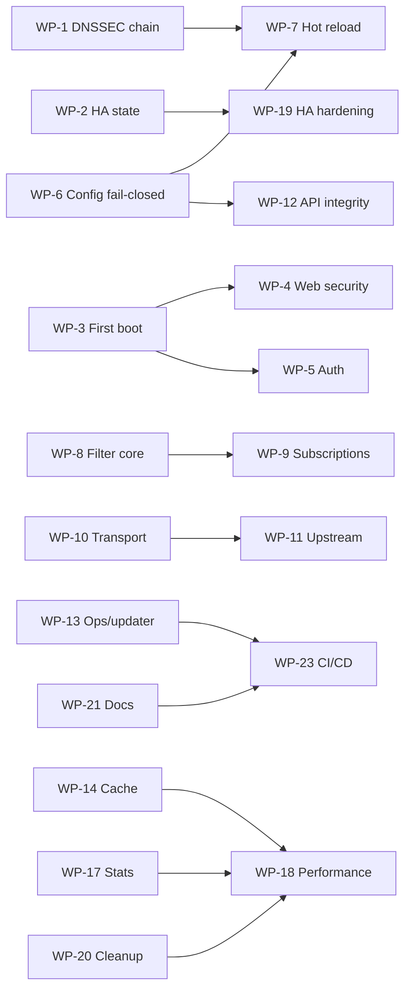

# Audit 4 — Full Remediation Plan (v1.6.0)

This document plans the remediation of every finding from the Audit 4
independent review of v1.5.0 (source-verified, `file:line` references in the
WP scopes). It is a working roadmap: each work package (WP) is self-contained,
independently reviewable, and gated by tests.

## Approved decisions

1. **No breaking config/API changes.** The web UI keeps its default bind;
   first-boot safety comes from a one-time setup token plus rate limiting.
2. **`?token=` is deprecated, not removed.** It is accepted only on the
   WebSocket upgrade when no `Authorization` header is present, logs a warning,
   and is documented for removal in 2.0.
3. **DNSSEC stays enabled by default (`dns.dnssec.validate = true`) and must be
   non-bypassable.** WP-1 lands atomically before any release; there is no
   interim default-off. Semantics are fail-closed: a chain that cannot be
   proven is `Bogus`, never silently `Insecure`.

## Ground rules

- One branch / one PR per WP (`fix/...`, `feat/...`, `chore/...`); conventional
  commits with the WP id in the body.
- Baseline green at every commit:
  `cargo fmt --all --check`,
  `cargo clippy --workspace --all-features -- -D warnings`,
  `cargo test --workspace --all-features`,
  `cargo-deny check`.
- Every behavior change ships with regression tests (unit + `sito-test`
  acceptance when user-visible), `CHANGELOG.md` `[Unreleased]` entry,
  `docs/configuration-reference.md` update, and regenerated
  `docs/openapi.json`.
- Fail-closed for security. No new dead knobs: a setting is wired, removed, or
  documented as reserved with a startup warning. No `let _ =` on
  security/apply paths.
- Release version: **1.6.0** for this remediation batch.

## Dependency graph

Sizing: **S** ~1-2 days, **M** ~3-5 days, **L** ~1-2 weeks (single developer,
tests and docs included).

---

## Wave 0 — P0 blockers

### WP-1 — DNSSEC trust-chain correctness (L, no deps)

**Findings.** Cross-zone DS acceptance (`sito-dnssec/src/lib.rs:632-665`),
RRSIG not bound to its RRset (`:849-887`), root anchor unreachable
(`:350`), stripping downgrade (`:787-792`), NSEC/NSEC3 denial bypass
(`:894-941`), poisoned/unbounded key cache (`:223-243,824-845`), no algorithm
policy (`:466-472`), NTA root matching (`:517-524`).

**Scope.**
1. Enforce hierarchy in DS delegation: DS owner must be a strict subdomain of
   the signing parent; RRSIG signer must equal the parent DNSKEY owner; child
   key owner must equal the DS owner. Reject cross-zone DS.
2. Bind every RRSIG to a non-empty, relevant covered RRset; an empty coverage
   set is a validation failure. `Secure`/AD is granted only for the answer
   RRset or a validated negative proof, never for an unrelated signature.
3. Fetch the root DNSKEY during the chain walk and link to root anchors;
   bounded depth/budget/cycle detection.
4. Fail-closed downgrade handling: maintain a `signed_zones` cache for zones
   whose DS link validated; a later response under a known-signed zone with no
   RRSIGs is `Bogus`. DS absence is `Insecure` only with an authenticated
   NSEC/NSEC3 denial from the validated parent, otherwise `Bogus` in
   `validate`/`strict` mode.
5. Validate NSEC and NSEC3 negative proofs (NXDOMAIN and NODATA) against
   validated keys; only opt-out NSEC3 downgrades to `Insecure`; cap NSEC3
   iterations (RFC 9276).
6. Key cache: insert only after signature verification; never overwrite a
   validated entry with an unvalidated one; bound size with expiry purge.
7. RFC 8624 algorithm policy: reject RSAMD5/DSA/RSASHA1/GOST and SHA-1 DS
   digests for validation; RSA >= 2048 where applicable.
8. Bounds and hygiene: cap DNSKEY/DS/RRSIG counts, signer fetch count and
   fixpoint rounds; +/-300 s clock skew; fix root/NTA matching and evaluate
   NTAs against all questions; no duplicate EDE options.
9. CD/DO semantics: CD=1 skips SERFAIL (AD cleared); AD only for validated
   answers. Coordinate the small pipeline patch with WP-7.
10. Keep `validate = true` default; no config change.

**Tests.** Hostile-chain suite: cross-zone DS, replayed public RRSIG,
stripped RRSIG after a signed answer, wrong NSEC owner, expired/not-yet-valid
signatures with skew, poisoned key cache, algorithm downgrade, NSEC3 opt-out,
fetch-budget exhaustion. End-to-end mock root -> TLD -> zone in `sito-test`.
Extend the fuzz target with NSEC/NSEC3 corpora.

**DoD.** Default anchors validate a real signed zone chain; every bypass test
returns `Bogus`/SERVFAIL; unsigned delegations proven by authenticated denial
stay `Insecure`; fuzz and benchmarks clean.

---

### WP-2 — HA versioning and replication state (M, no deps)

**Findings.** Initial bundle version 1 rejected by the monotonic guard with the
error swallowed (`sito/src/server.rs:272-304`,
`sito-ha/src/master/coordinator.rs:90-101`); master version never persisted
(silent divergence after restart); stale slave ACKs recorded as success;
non-atomic version allocation; unbounded fallback delivery tasks.

**Scope.**
1. Coordinator starts at 0; publish v1 at startup. Persist current version and
   active bundle to `<data_dir>/ha_state.toml` (0600, atomic) and restore on
   boot so sequence numbers are monotonic across restarts.
2. Atomic version allocation (compare-and-swap); concurrent publishers get a
   conflict result instead of a swallowed error.
3. Slave ACK handling: `applied=false` triggers retry and is not logged as
   success; stale `have_version` cannot suppress pushes.
4. Cap/coalesce fallback delivery (bounded queue, one queued push per slave).
5. Secrets: `substitute_secrets(allow_missing=false)` on the slave; wire
   `scan_for_secrets` into `sanitize_config_for_bundle`/publish (currently dead
   code); slave config writes 0600 atomic.
6. Config validation coherence: empty `pinned_slave_fingerprints` with
   `cert`/`key` requires `ca` or fails validation; `allow_unpinned_tls`
   produces a prominent warning.

**Tests.** Fresh-master E2E (slave receives v1), master restart at vN with a
live slave, concurrent publish race, leaked-secret rejection, stale-ACK retry.
Update `m8`/`m9` acceptance to stop pre-publishing v2.

---

## Wave 1 — P1 security and correctness

### WP-3 — First-boot exposure and probe containment (M)

**Findings.** Default `0.0.0.0:8080` plaintext admin while `/wizard` and
`/ui/upstreams/test` are unauthenticated during setup
(`sito-api/src/router.rs:75-97`, `ui/handlers.rs:1175-1339,1942-2089`).

**Scope.** One-time setup token generated on first boot, printed to console and
reported via the setup API; wizard and upstream-test require it; setup completion
rate-limited; upstream test denies loopback/link-local/private/metadata targets,
caps host count and concurrency; keep the default bind (approved decision) and
fix the misleading plaintext warning in `sito/src/server.rs:401-405`.

### WP-4 — Web security: CSRF, headers, cookies (M)

**Findings.** No CSRF tokens; Origin check accepts `null`/missing
(`sito-api/src/security.rs:57-98`); CSP allows `unsafe-inline`/`unsafe-eval`;
no `Cache-Control: no-store`; HSTS trusts client-supplied proto.

**Scope.** Session-bound CSRF tokens on all mutating forms and JSON endpoints;
strict Origin/Referer (reject `null` and missing); `__Host-` session cookie;
`no-store` on auth/config responses; tightened CSP; HSTS only when TLS is
terminated by the server or a trusted proxy; complete header set.

### WP-5 — Auth hardening (M)

**Findings.** TOTP replay and 32-bit backup codes (`auth/totp.rs:49-95`);
Argon2 under the auth mutex in async handlers (`auth/manager.rs:590-733`);
`?token=` on every endpoint (`auth/rbac.rs:94-109`); user enumeration; weak
session eviction; unbounded non-expiring tokens; restore preview unmasked;
`disable_totp` without re-auth; backup codes unusable in the UI.

**Scope.** Argon2 via `spawn_blocking` outside the mutex; TOTP replay cache;
backup codes >= 128-bit and Argon2-hashed with UI support; re-auth (password
and TOTP when enabled) for 2FA disable; `?token=` restricted to the WebSocket
upgrade without `Authorization`, warned and documented as deprecated; ordered
session eviction plus token cap and non-zero default TTL; lock-poisoning
recovery; user-enumeration constant-time behavior.

### WP-6 — Config fail-closed and validation (M)

**Findings.** `clients`, `rewrites`, `integrations` silently become defaults on
type errors (`sito/src/server.rs:128-203`); `check-config` misses sections and
port conflicts; `get_web/stats/auth` warn-and-default; dead knobs.

**Scope.** Surface parse errors at startup (fail unless
`--ignore-invalid-sections`); validate all sections and port conflicts in
`check-config`; typed or explicitly validated raw sections; remove or wire dead
knobs.

### WP-7 — Hot reload correctness and completeness (M)

**Findings.** Watcher dead with the default relative path
(`sito/src/server.rs:497-506`); DNSSEC validator and scoped upstreams never
reloaded (`:125,135-171`); reload handlers report success without applying
(`sito-api/src/handlers/config.rs:233-255`).

**Scope.** Canonicalize config path and compare canonical event paths; start
watching even if the file is absent; reload DNSSEC, scoped upstreams, cache
config, rate limits, retention and log level atomically; report restart-only
settings truthfully; no silent success from reload endpoints.

### WP-8 — Filter engine and parser correctness (L)

**Findings.** IDN/punycode bypass (`sito-filter/src/engine.rs:590-629`,
`sito-proto/src/normalize.rs:17-22`); Aho-Corasick non-overlapping
(`compiled.rs:76-83`); case-sensitive prefix/wildcards (`parser.rs:657-667`);
regex slash escaping (`:592-599`); modifier list splitting (`:509`);
unknown modifiers drop rules (`:527-531`); hash-order precedence
(`engine.rs:494-497`); drop-guard off-by-one (`:513`); reload race
(`:471,523`); first-boot fail-open (`:388-391`); DFA compile DoS
(`compiled.rs:214-263`).

**Scope.** Consistent ASCII/punycode normalization (never fail-open); overlap-
aware matching; case-insensitive prefix/wildcards; correct regex/config
splitting; explicit unknown-modifier policy with logging; deterministic
cross-list precedence; guard fixes; compile bounds; first-boot loading state
with fail-closed option; single-pass candidate collection.

### WP-9 — Subscription and downloader safety (M)

**Findings.** `file://` arbitrary read and redirect SSRF
(`sito-filter/src/subscription.rs:121-162`); unbounded body before size check;
304 retry break (`:188-197`); cache filename collisions; dead `ListDownloader`;
runtime-list drop guard missing (`sito-clients/runtime_lists.rs:185-203`).

**Scope.** Remove or allowlist `file://`; disable redirects and deny
private/metadata targets; stream body with a hard cap; fix 304 handling; hashed
cache filenames; remove or use the dead downloader; truncation/drop guard and
hosts/regex parsing fixes for runtime lists.

### WP-10 — Transport limits and protocol correctness (L)

**Findings.** UDP amplification and `MSG_TRUNC` (`sito-transport/src/udp.rs:
162-193`); no TLS handshake timeout (`dot.rs:129`, `doh.rs:316-327`); unbounded
DoT task spawn (`dot.rs:240-255`); u16 length wrap (`tcp.rs:130`, `dot.rs:163`,
`doq.rs:210`); zero-length frame spin (`tcp.rs:161-163`); unbounded limiter
buckets (`limiter.rs:55-98`); per-protocol rate budgets (`server.rs:1159-1290`);
ACME cleanup/SNI/perms (`acme.rs:362-425`).

**Scope.** Enforce `min(client, server)` UDP truncation and MSG_TRUNC; recv
error resilience; handshake/idle/write timeouts; per-connection pipeline
semaphore; reject >64 KB framing and `00 00` frames; bounded rate-limiter
buckets and a shared per-client budget; ACME error cleanup, SNI preservation on
reload, 0600 for existing keys.

### WP-11 — Upstream protocol and failover correctness (M)

**Findings.** DoH GET validation always fails (`sito-upstream/src/doh.rs:
116-145`); unbounded body and redirects (`:161-171,58-71`); vacuous DoQ ID
check (`doq.rs:176-180`); first-IP-only failover (`manager.rs:105-148`);
A-only bootstrap (`bootstrap.rs:86-108`); 4096 buffer (`plain.rs:99-108`);
health reset on reload (`manager.rs:250-256`).

**Scope.** Fix DoH GET ID handling; disable redirects; require content type;
stream with cap; real DoQ wire-ID check; multi-IP candidates and periodic
re-resolution; bootstrap AAAA and single-flight; EDNS-sized UDP buffer; overall
resolution deadline; health preservation and parallel probes.

### WP-12 — API data integrity and truthful responses (M)

**Findings.** Index-based IDs (`handlers/rewrites.rs:60-138`); client group
field wipe (`handlers/clients.rs:398-429`); update_client resets/renames
(`:219-256`); `doh_path` unreachable (`:66-78`); stats overflow
(`handlers/stats.rs:17-23`); updater version compare and tar bomb
(`updater.rs:137-141,645-676`); ignored reload errors; silent no-op saves;
restore preview unmasked; querylog pagination.

**Scope.** Stable IDs; merge-preserving updates and duplicate checks; fix
classification; clamp windows; strict semver and per-entry decompression cap;
surface reload errors; no success on failed persistence; mask restore preview;
pagination/caps.

### WP-13 — Ops, installer, updater, healthcheck (M)

**Findings.** Installer defaults to 1.4.0 (`contrib/install.sh:6`); healthcheck
accepts web-only (`crates/sito/src/cli.rs:215-250`); self-update impossible
under systemd (`sito-api/src/updater.rs:679-695`); Docker data volume perms;
`gen-certs` docs mismatch; unpinned bases.

**Scope.** Derive installer version from the release; DNS healthcheck requires
a correct ID/rcode and only falls back to web during setup; systemd-safe update
path or documented helper; data-volume ownership and digest-pinned bases;
reconcile cert docs/flags; updater signature policy default-on with repo
identity pinning.

---

## Wave 2 — P2 correctness and performance

### WP-14 — Cache correctness and coalescing (M)

Cache key ignores DO/CD/ECS (`sito-cache/src/key.rs:7-11`); stale AD retained
(`cache.rs:179-190`); negative without SOA; any-rcode insert; no single-flight;
resize clones.

### WP-15 — Rewrites correctness (S)

CNAME cycles still emitted (`sito-rewrites/src/table.rs:154-219`); wildcard
precedence insertion-ordered; single answer; CGNAT/link-local classification.

### WP-16 — Client identification and policy integrity (M)

SNI/display-name impersonation (`sito-clients/src/registry.rs:117-151,317-326`);
RouterOS hostname trust (`:205-225`, `routeros.rs:180-184`); CIDR order;
schedule fail-open (`schedule.rs:110`); per-query clones; tiny bundled lists.

### WP-17 — Stats retention and metrics performance (M)

Non-transactional retention and watermark skips (`sito-stats/src/db.rs:
508-608`); dropped batches (`writer.rs:136-147`); hot-path global mutex
(`metrics.rs:112-143`); stub metrics; label escaping; index.

### WP-18 — Performance pass (M)

Pipeline double evaluation and allocations; cache single-flight; DoH router
per connection; single cert watcher; query-log strings; benchmark gates.

### WP-19 — HA hardening leftovers (M)

Bundle hash verification; plaintext WS replay protection; resync busy-spin;
metric label cleanup; pin-only expiry; `ca`/pins precedence.

---

## Wave 3 — P3 hygiene and process

### WP-20 — Cleanup, dead code, hardcoded constants (M)

Delete `AppState`, unused helpers; wire or delete stub metrics; split
`run_server_full`; dedupe TLS acceptors and response builders; centralize magic
numbers; derive version/commit/UA strings.

### WP-21 — Documentation truth pass (S-M)

Audit4 record; correct overclaims in `docs/audit3.md`; sync README,
configuration reference, example config, runbooks, compatibility; changelog.

### WP-22 — Test infrastructure and regression coverage (M)

Port broker instead of probe-then-bind; event-driven waits; regression tests
for every P0/P1; HA bundle fuzz target; property tests; nightly perf gate.

### WP-23 — CI/CD hardening (S)

Least-privilege `permissions:`; no shell interpolation of inputs; tighten
`deny.toml`; container signing/provenance/SBOM; dependency dedupe; keep actions
SHA-pinned.

---

## PR sequencing

| Order | Work packages | Theme |
|---|---|---|
| 1 | WP-1, WP-2 | P0: validation and replication |
| 2 | WP-3, WP-4, WP-5, WP-6 | P1 exposure/auth/config |
| 3 | WP-7, WP-8, WP-9, WP-10, WP-11 | P1 runtime correctness |
| 4 | WP-12, WP-13 | P1 API/ops |
| 5 | WP-14 ... WP-19 | P2 correctness/performance |
| 6 | WP-20 ... WP-23 | P3 hygiene/process |
| 7 | version bump to 1.6.0, release notes | release |

## Status

| WP | Status |
|---|---|
| WP-1 | Done |
| WP-2 | Done |
| WP-3 | Done |
| WP-4 | Done |
| WP-5 | Done |
| WP-6 | Done |
| WP-7 | Done |
| WP-8 | Done |
| WP-9 | Done |
| WP-10 | Done |
| WP-11 | Done |
| WP-12 | Done |
| WP-13 | Done |
| WP-14 | Done |
| WP-15 | Done |
| WP-16 | Done |
| WP-17 | Done |
| WP-18 | Done |
| WP-19 | Done |
| WP-20 | Done |
| WP-21 | Done |
| WP-22 | Done |
| WP-23 | Done |

---

## Known remaining / accepted limitations (v1.6.0)

These items were explicitly left as follow-ups or accepted trade-offs; none
weakens a fail-closed security decision:

- **WP-20 (done)**: `run_server_full` is down from 878 to 337 lines with
  `init_ha`, `init_runtime_components`, `init_tls_and_acme`,
  `run_config_watcher`/`ConfigWatcher`, `shutdown_server`,
  `build_tls_acceptor` and `canonical_config_path` extracted. Startup magic
  numbers are named constants; dead `AppState`, stub metrics and hardcoded
  strings/URLs are removed.
- **WP-22 (done)**: the harness now uses a reserved-port broker plus a
  process-wide spawn lock, `wait_until` replaced the fixed sleeps in the
  certificate-reload, m7 listener and m8 HA connect/sync tests (only semantic
  timing sleeps remain), randomized invariant tests cover `normalize_domain`
  and the ABP parser, `fuzz_ha_bundle` is in the nightly matrix, and the
  nightly `release-tests` (SITO_BENCH_TESTS) plus criterion bench jobs gate
  performance. `cargo clippy --workspace --all-features --all-targets` is
  warning-free.
- **DNSSEC**: ED448 keys are policy-rejected (hickory 0.26 has no ED448
  implementation) and wildcard NODATA NSEC proofs are not enumerated; both
  fail closed (`Bogus`), never `Secure`.
- **Web UI**: CSP keeps a documented `'unsafe-eval'` exception for the bundled
  Alpine/HTMX runtime and a small inline-script exception for Swagger UI;
  the setup token is passed in the URL by design (one-time, rate-limited,
  `Referrer-Policy: no-referrer`).
- **Rate limiting**: budgets are still enforced per listener protocol rather
  than per client across protocols; the bounded bucket table and per-IP
  semantics are in place.
- **`file://` list roots**: the allowlist is the server data directory plus
  programmatic roots; there is no TOML knob for extra roots yet.
- **`?token=`**: accepted only on the WebSocket upgrade without an
  `Authorization` header, warned and documented for removal in 2.0.
- **`auth.token_default_ttl_days = 0`** remains the documented default
  (tokens do not expire unless configured).
- **Self-update under systemd**: `sito update` must run as root with the
  service stopped; the unit keeps `ProtectSystem=strict`.
- **Transport**: `ha gen-certs` supports repeatable `--san HOST_OR_IP`; the
  runbook documents LAN certificate generation.
